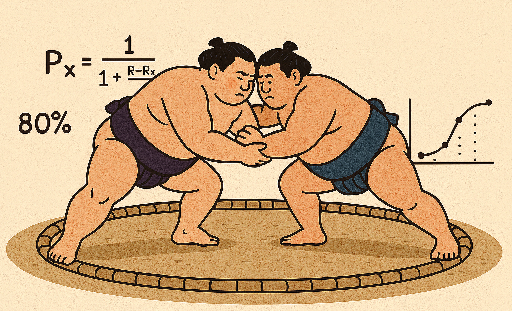

```{r}
#| echo: false
#| output: false

library(tidyverse)
library(plotly)
library(gt)
library(DT)
source( "sumo_api.R" )
source( "elo_reports.R")

basho_id = current_basho()

matches_cache <- readRDS( "matches_cache.Rdata")
elo_history   <- readRDS( "elo_history.Rdata")
sumo_name_t   <- all_rikishi() |> select( rikishiId = id, shikona = shikonaEn )

day <- day_number(today(), current_basho())+1

```

Welcome to the rikishi Elo scoreboard! This page gives you a quick way to see who’s looking strongest in the current basho.

{fig-align="center" width="60%"}

## Sumo Strength by the Numbers

Each wrestler has an Elo rating, which goes up when they win and down when they lose, so the numbers shift day by day as the action unfolds.

Match odds are based on the gap between two wrestlers’ scores — a big difference means there’s a clear favorite, while a closer spread means we could be in for a real battle.

If you’d like to dive into the math behind it all, check out the [Elo model details](sumo_elo.html)

## Elo Trends for `r basho_description(basho_id)`

Each point represents a rikishi's current Elo rating. The rikishi are organized by banzuke ranking, and color coded by rank name. The tail above or below the point shows the change in elo over the course of the current tournament. Mouse over points to see the rikishi name.

```{r}
#| echo: false
#| fig-align: center
#| out-height: auto

banzuke_rank <- basho_sumo_rank( basho_id ) |>
  filter( rank_name != "Jonokuchi", rank_name != "Jonidan", rank_name != "Sandanme", rank_name != "Makushita", rank_name != "Juryo" )


banzuke_elo <- banzuke_rank |> left_join( elo_as_of( basho_id, 1 ), by="rikishiId" ) |>
  mutate( elo = coalesce( elo, 1500), ordinal_rank = 1:n())  |>
select( -rank ) |> 
  rename( pre_tournament_elo = elo, rank=rank_name ) |>
  left_join( elo_as_of( basho_id, day ), by="rikishiId" ) |>
  left_join( sumo_name_t, by="rikishiId" )


pp<- ggplot( banzuke_elo, aes( ordinal_rank, elo, color=rank, text=shikona)) +
  geom_segment( aes( x=ordinal_rank, y=pre_tournament_elo, xend=ordinal_rank, yend = elo), arrow=arrow(length=unit(0.15, "inches"))) +
  geom_point(size=1.5) +
  scale_color_brewer( palette ="Set2") +
  labs( title = paste0("Elo Movement" )) +
  xlab("banzuke rank")

ggplotly(pp, tooltip = "text", width=600 ) |> 
  layout(
    legend = list(
      orientation = "h",     # horizontal
      x = 0.5,               # center horizontally
      xanchor = "center",
      y = -0.2               # move below the plot
  )) 

```

## `r if(day > 15) "Tournament Summary" else "Today’s Rikishi Power Meter"`

### `r if(day > 15) paste("Final Standings —", basho_description(basho_id)) else paste("Head-to-Head Odds - Day", day)`

```{r}
#| echo: false

if( day > 15 ) {

  tournament_stats <- elo_history |>
    filter( bashoId == basho_id, !is.na(win) ) |>
    group_by( rikishiId ) |>
    summarize(
      final_elo             = last(new_elo),
      actual_wins           = sum(win),
      expected_wins         = sum(pwin),
      matches               = n(),
      .groups = "drop"
    ) |>
    mutate(
      actual_minus_expected = actual_wins - expected_wins,
      record                = paste0( actual_wins, "-", matches - actual_wins )
    )

  pre_elo <- elo_as_of( basho_id, 1 ) |> select( rikishiId, pre_elo = elo )

  summary_table <- banzuke_rank |>
    left_join( sumo_name_t,    by = "rikishiId" ) |>
    left_join( pre_elo,        by = "rikishiId" ) |>
    left_join( tournament_stats, by = "rikishiId" ) |>
    mutate(
      delta_elo = final_elo - coalesce( pre_elo, 1500 ),
      headshot  = paste0( "sumo_headshots/", shikona, ".jpg" )
    ) |>
    select( headshot, shikona, rank_name, record, actual_wins, final_elo, delta_elo, actual_minus_expected )

  gt( summary_table ) |>
    text_transform(
      locations = cells_body(columns = headshot),
      fn = \(x) local_image( filename = x, height = 40)
    ) |>
    tab_options(table.width = pct(90)) |>
    tab_options(table.font.size = "15px") |>
    fmt_number(
      columns  = c( final_elo, delta_elo ),
      use_seps = FALSE,
      decimals = 0
    ) |>
    fmt_number(
      columns  = actual_minus_expected,
      decimals = 1,
      force_sign = TRUE
    ) |>
    cols_label(
      headshot              = "",
      shikona               = "Name",
      rank_name             = "Rank",
      record                = "Record",
      final_elo             = "Final Elo",
      delta_elo             = "Δ Elo",
      actual_minus_expected = "Actual − Expected"
    ) |>
    cols_hide( actual_wins ) |>
    tab_style(
      style = cell_text( color = "darkgreen", weight = "bold"),
      locations = cells_body(
        columns = c( record, delta_elo, actual_minus_expected ),
        rows    = actual_wins >= 8
      )
    ) |>
    tab_style(
      style = cell_text( color = "darkred", weight = "bold"),
      locations = cells_body(
        columns = c( record, delta_elo, actual_minus_expected ),
        rows    = actual_wins < 8
      )
    ) |>
    tab_style(
      style = cell_text( color = "darkgreen", weight = "bold"),
      locations = cells_body(
        columns = delta_elo,
        rows    = delta_elo > 0 & actual_wins < 8
      )
    ) |>
    tab_style(
      style = cell_text( color = "darkred", weight = "bold"),
      locations = cells_body(
        columns = delta_elo,
        rows    = delta_elo < 0 & actual_wins >= 8
      )
    ) |>
    tab_style(
      style = cell_text( color = "darkgreen", weight = "bold"),
      locations = cells_body(
        columns = actual_minus_expected,
        rows    = actual_minus_expected > 0 & actual_wins < 8
      )
    ) |>
    tab_style(
      style = cell_text( color = "darkred", weight = "bold"),
      locations = cells_body(
        columns = actual_minus_expected,
        rows    = actual_minus_expected < 0 & actual_wins >= 8
      )
    )

} else {

  match_sheet <- get_match_sheet( basho_id,  day )

  match_sheet <- match_sheet |>
    mutate(
      record_east = paste0( wins_east, "-", losses_east),
      record_west = paste0( wins_west, "-", losses_west),
      elo_gap    = paste( round(elo_mismatch), ifelse( elo_east>=elo_west, "←","→")),
      headshot_east = paste0( "sumo_headshots/", eastShikona, ".jpg"),
      headshot_west = paste0( "sumo_headshots/", westShikona, ".jpg")
    )

  prediction_sheet <- match_sheet |>
    select( matchNo,headshot_east, eastShikona, record_east, elo_east, pwin_east, odds_east, elo_gap,  odds_west, pwin_west, elo_west, record_west,  westShikona, headshot_west )

  gt( prediction_sheet) |>
    text_transform(
      locations = cells_body(columns = c( headshot_east, headshot_west)),
      fn = \(x) local_image( filename = x, height = 40)
    ) |>
    tab_options(table.width = pct(90)) |>
    tab_options(table.font.size = "15px") |>
    fmt_number(
      columns = c(`elo_east`, `elo_west`, `elo_gap` ),
      use_seps = F,
      decimals = 0
    ) |>
    fmt_number(
      columns =  c( `pwin_east`, `odds_east`,  `pwin_west`, `odds_west` ),
      decimals = 2
    ) |>
    cols_align(
      align = "right",
      columns = `elo_gap`
    ) |>
    tab_spanner(
      label = "East",
      columns = c( headshot_east, eastShikona, record_east, elo_east, pwin_east, odds_east)
    ) |>
    tab_spanner(
      label = "West",
      columns = c( odds_west, pwin_west, elo_west, record_west,  westShikona, headshot_west)
    ) |>
    cols_label(
      matchNo = "Match",
      headshot_east = "",
      eastShikona = "Name",
      record_east = "Record",
      elo_east = "Elo",
      pwin_east = "Win Prob",
      odds_east=  "Odds",
      elo_gap = "Elo Gap",
      odds_west = "Odds",
      pwin_west = "Win Prob",
      elo_west = "Elo" ,
      record_west = "Record" ,
      headshot_west = "",
      westShikona = "Name"
    ) |>
    tab_style(
      style = cell_borders(
        sides = "right",
        color = "black",
        weight = px(2)
      ),
      locations = cells_body(
        columns = c( `odds_east`, `elo_gap` )
      )
    )

}

```

## Day-by-day Review for `r basho_description(basho_id)`

```{r}
#| results: asis
#| echo: false

  if( day > 1)
  {
    for( day in (day-1):1 ) 
    {
      knitr::knit_child('match_recap.qmd', envir = environment(), quiet = TRUE) |>
        cat(sep = '\n\n')
    }
  }

```
